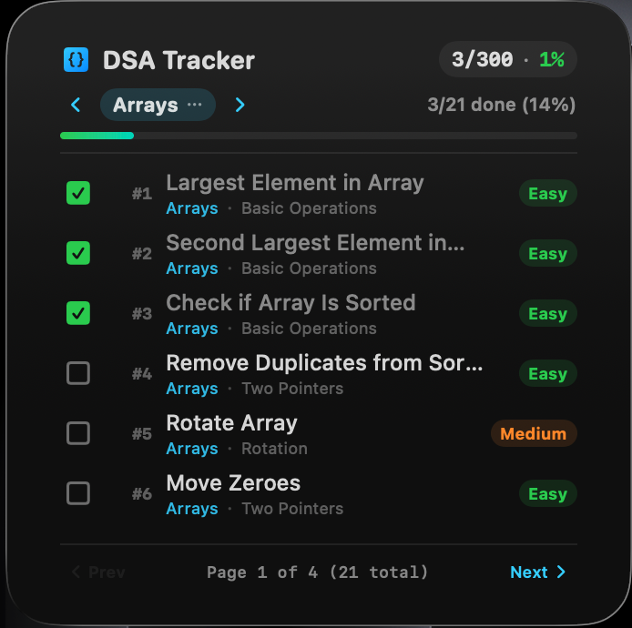
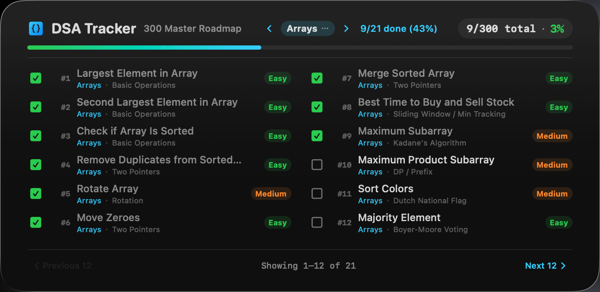

# DSA Tracker for macOS

A native desktop widget for tracking **300 DSA problems across 34 topics**.
Requires **macOS 14 or later**. The release includes Apple Silicon and Intel binaries.

## 📸 Preview

<p align="center">
  
  &nbsp;&nbsp;&nbsp;&nbsp;
  
</p>

> [!TIP]
> Place your widget screenshots in `docs/screenshots/large-widget.png` and `docs/screenshots/extra-large-widget.png` to showcase the widget in action.

## Features

- Check off problems directly in the widget, with immediate visual feedback.
- Follow a numbered roadmap with difficulty and subtopic labels.
- Open each problem on LeetCode or GeeksforGeeks in your default browser.
- Choose a topic from the category grid or cycle through topics with the arrows.
- View topic and overall completion totals.
- Page through six problems in Large, or twelve in two columns in Extra Large.
- Keep progress locally, with no account, server, or telemetry.

## Install

1. Download `DSA-Tracker-macOS-v1.0.0.zip` from the [first release](https://github.com/Niru-26016/dsa-tracker-macos/releases/tag/v1.0.0).
2. Unzip it and move `DSA Tracker.app` to `/Applications`. Replace the previous copy if upgrading.
3. Open the app once so macOS can discover its widget. The host has no window or Dock icon.
4. Right-click the desktop, choose **Edit Widgets**, find **DSA Tracker**, and add Large or Extra Large.

The app is locally signed (ad-hoc), **not Developer ID signed or notarized**.
macOS may block a downloaded copy. Only if you trust its source, use the approval
option in **System Settings → Privacy & Security** after attempting to open it.
Do not disable Gatekeeper globally.

`SHA256SUMS` is attached to the release. Download it beside the ZIP and verify with:

```bash
shasum -a 256 -c SHA256SUMS
```

## Usage and troubleshooting

Click a checkbox to change completion, a problem title to open its page, and the
topic pill to open the category grid. Completion counts reconcile after the saved
state reaches the refreshed widget timeline.

To reposition the widget, keep **Edit Widgets** open and drag from an empty area.
macOS controls desktop placement and rearrangement of icons. If Apple's widgets
also snap back, troubleshoot the desktop layout rather than the tracker.

If the widget is missing after installation, open the host app once and reopen
Edit Widgets. If macOS still has not discovered it, register the installed bundle:

```bash
/System/Library/Frameworks/CoreServices.framework/Frameworks/LaunchServices.framework/Support/lsregister -f "/Applications/DSA Tracker.app"
pluginkit -a "/Applications/DSA Tracker.app/Contents/PlugIns/DSATrackerWidgetExtension.appex"
```

## Build and test

Install Xcode 16 or later and its command-line tools. This is a Swift project:
**Node.js, npm, and node_modules are not required**. There are no external Swift
package dependencies. The checked-in Xcode project builds both the host and widget.

```bash
git clone https://github.com/Niru-26016/dsa-tracker-macos.git
cd dsa-tracker-macos
swift test
bash scripts/bundle_app.sh
```

The app is generated at `build/Build/Products/Release/DSA Tracker.app`. The build
script builds both architectures and verifies the bundle signatures; it does not
install the app or publish a release. `swift build` alone only builds the host,
not the widget extension.

To produce a ZIP and checksum:

```bash
bash scripts/package_release.sh
```

Output goes into `dist/`. Both `build/` and `dist/` are ignored by Git. Release
binaries are attached to GitHub Releases, not committed to the source tree.
GitHub Actions runs the tests and universal packaging checks on pushes and PRs.

`project.yml` is the XcodeGen project definition. If you change project structure,
install XcodeGen and run `xcodegen generate`, then commit the updated project too.

## Data and curriculum

The widget stores progress in its local sandbox, normally:

```text
~/Library/Containers/com.dsatracker.mac.widget/Data/Library/Application Support/DSATracker/problems.json
```

Topic and page preferences live beside that file. Back up this folder before
manually editing stored data. Concurrent completion writes are serialized and
saved atomically. An unreadable progress file is not overwritten by checkbox or
reset actions; preserve it for recovery if an action fails.

Edit [StarterProblems.swift](Sources/DSATrackerMac/Models/StarterProblems.swift) to
change the curriculum. IDs remain stable across restarts and reordering. Legacy
saves migrate by topic and title, with a unique-title fallback for topic moves.
Renaming a problem changes its generated ID; moving and renaming it together may
require an explicit migration to retain its checkmark.

## Project layout

```text
Sources/DSATrackerMac/          Headless host and shared models
Sources/DSATrackerWidget/       Widget views and interactive intents
Tests/DSATrackerMacTests/       Persistence, migration, concurrency, paging tests
Support/                      App and extension plists and entitlements
DSATracker.xcodeproj/          Buildable Xcode project
project.yml                   XcodeGen source
scripts/                      Universal build and release packaging
.github/workflows/ci.yml       macOS checks
```

Local tests cover model behavior; they do not prove macOS desktop drag behavior,
WidgetKit scheduling latency, or the availability of every external problem URL.

## License

[MIT](LICENSE).
